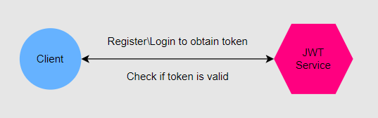

# JWT (JSON Web Token) Realization
\
Detailed information about what the JWT is and how to use it you can find
by following the links at the bottom of the text.

Here I will provide a brief overview of this project and discuss the main points.

## Project Structure

## API Overview
The project consists of just one service called **'jwt-service'** that provides three functional endpoints:

- **Endpoint '../api/v1/register'**
    - Allows **Client** to **register** using username and password.
    - If everything is correct the **Client** will receive a newly created **JWToken**.
    - In case of entering the username that is already in the database, the **Client** will receive a corresponding message in response.
- **Endpoint '../api/v1/login'**
    - Allows **Client** to **login** using username and password.
    - If everything is correct the **Client** will receive a newly created **JWToken**.
    - In case of entering incorrect username or password, the **Client** will receive a corresponding message in response.
- **Endpoint '../api/v1/validate'**
    - Allows **Client** to check if **JWToken** is **valid**.
    - If token is valid - returns **true**.
    - If token is not valid - returns **false**.

## Sources

[Introduction to JSON Web Tokens](https://jwt.io/introduction)
\
[What Is JWT and Why Should You Use JWT](https://www.youtube.com/watch?v=7Q17ubqLfaM&ab_channel=WebDevSimplified)
\
[What is JWT ? JSON Web Token Explained](https://www.youtube.com/watch?v=926mknSW9Lo&ab_channel=Bitfumes)